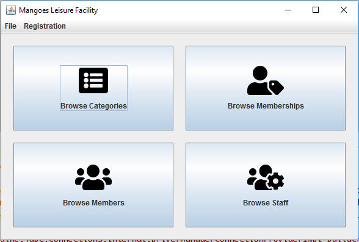

# MangoesLeisureFacility

A Java Desktop application for a fitness and leisure school. Java Swing Application Has never been much better.

## Side Note

You might wanna know the application is using Hibernate Implementation of JPA for persistence, it makes persistence a cinch

If you interested at all, am also using the repository design pattern, just the basics

## The Registration Module
Take care of registering Members and Staff

## The Booking Module

####Facilities

All Facilities

Add Facility Dialog

